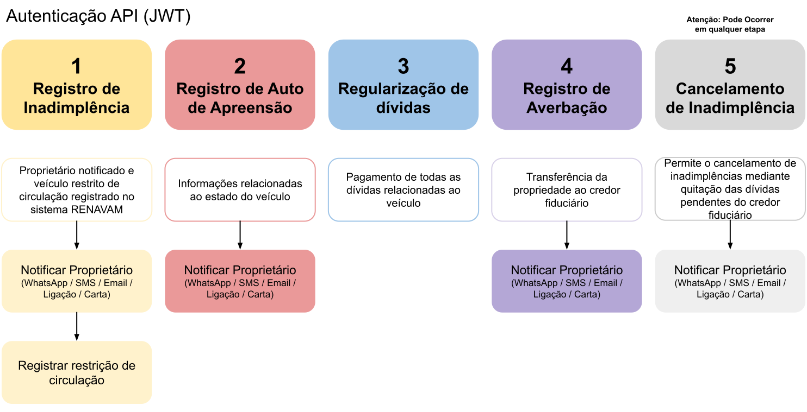

# Detran API <Badge type="warning" :text="`v ${apiVersion}`" />

A API de Retomada de Veículos, desenvolvida pelo Detran, facilita a gestão de processos de retomada extrajudicial de veículos. Ela oferece endpoints para autenticação, criação, cancelamento de retomadas e transferência de propriedade, automatizando e simplificando operações com maior eficiência e segurança.

## Visão Geral

O diagrama abaixo ilustra as principais etapas do processo de retomada de veículos, desde a autenticação até a regularização de dívidas. Cada etapa é representada por um endpoint específico da API, permitindo uma visão clara do fluxo de dados e das interações necessárias para a execução bem-sucedida do processo.

{.img-fluid.no-border}

 

<OASpec
  :groupByTags="false"
  :hideInfo="true"
  :hideServers="true"
  :hideBranding="true"
  :hidePathsSummary="false"
  :spec="loadSpec"
/>

