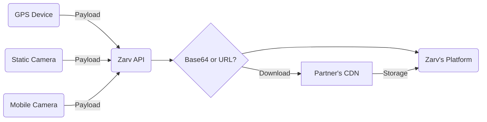

# GPS Devices Data Providers Guide

This guide provides an overview of integrating GPS devices as data providers into your system.

## Overview

GPS devices are essential for tracking location data in real-time. They provide accurate geolocation information that can be used in various applications, such as logistics, fleet management, and personal navigation.

## Integration Steps

1. **Choose a GPS Device**  
  Select a GPS device that meets your requirements in terms of accuracy, connectivity, and compatibility.

2. **Set Up the Device**  
  Follow the manufacturer's instructions to configure the GPS device. Ensure it is properly calibrated and connected to your system.

3. **Connect to the System**  

- Use APIs or SDKs provided by the GPS device manufacturer.  
- Establish communication via supported protocols (e.g., NMEA, TCP/IP, or Bluetooth).

4. **Parse GPS Data**  
  Extract and process data such as latitude, longitude, altitude, and timestamps. Ensure the data format aligns with your application's needs.

5. **Store and Use Data**  
  Save the GPS data in your database or use it directly in your application for real-time processing.

## Best Practices

- **Data Validation**: Ensure the GPS data is accurate and free of errors.  
- **Security**: Encrypt communication between the GPS device and your system.  
- **Error Handling**: Implement fallback mechanisms for scenarios where GPS signals are weak or unavailable.

## Troubleshooting

- **No Signal**: Check the device's placement and ensure it has a clear view of the sky.  
- **Incorrect Data**: Verify the device's configuration and calibration.  
- **Connection Issues**: Test the communication protocol and network settings.

## Additional Resources

- [GPS Device Manufacturer Documentation](#)  
- [NMEA Protocol Specification](#)  
- [Troubleshooting GPS Connectivity](#)

By following this guide, you can successfully integrate GPS devices as data providers into your system.
