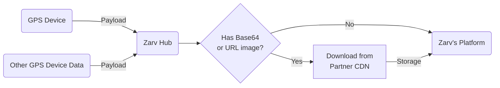

# GPS Devices Data Providers Guide

GPS devices are essential for tracking location data in real-time. They provide accurate geolocation information that can be used in various applications, such as logistics, fleet management, and personal navigation.

This guide provides an overview of integrating GPS devices as data providers into your system.



## API Fields

| Field                                                                | Type   | Description { class="compact" }                       |
| -------------------------------------------------------------------- | ------ | ----------------------------------------------------- |
| device.id <Badge type="warning" text="required" />                   | String | Device IMEI                                           |
| device.status <Badge type="warning" text="required" />               | String | [Command status ENUM](#available-api-enums)           |
| device.gsm_signal                                                    | Number | GSM RSSI Signal Value [Description](#gsm-rssi)        |
| device.gsm_signal_level                                              | String | GSM RSSI Signal Level [Description](#gsm-rssi-level)  |
| device.gps_satellites                                                | Number | Total availability GPS satellites                     |
| vehicle.vin <Badge type="warning" text="required" />                 | String | Vehicle VIN [Description](#VIN)                       |
| vehicle.license_plate                                                | String | Vehicle's License Plate                               |
| vehicle.engine_status <Badge type="warning" text="required" />       | String | Engine status (ON/OFF)                                |
| vehicle.speed <Badge type="warning" text="required" />               | Number | Speed value in Km/h                                   |
| vehicle.odometer <Badge type="warning" text="required" />            | Number | Vehicle odometer in Km                                |
| vehicle.battery.system <Badge type="warning" text="required" />      | Number | Vehicle battery voltage                               |
| vehicle.battery.device                                               | Number | Device battery voltage                                |
| vehicle.battery.device_percentage                                    | Number | Device battery percentage                             |
| vehicle.location.elevation                                           | Number | Vehicle elevation in meters                           |
| vehicle.location.heading                                             | Number | Vehicle heading in degrees                            |
| vehicle.location.location <Badge type="warning" text="required" />   | Array  | [longitude, latitude]                                 |
| vehicle.behavior                                                     | String | [One of available behaviours](#available-api-enums)   |
| received_at                                                          | String | Date of the event received by the platform in UTC ISO |
| created_at <Badge type="warning" text="required" />                  | String | Date of the event in UTC ISO                          |

:::warning What is the VIN?

The VIN - Vehicle Identification Number (or NIV - Número de Identificação do Veículo), is the universal registration system for automotive vehicles that are produced.

:::

:::details GSM RSSI Level

| RSSI Level | Signal strength | Description                                                                                                  |
| ---------- | --------------- | ------------------------------------------------------------------------------------------------------------ |
| EXCELENT   | Excelent        | Strong signal with minimal interferences excelent data speeds                                                |
| GOOD       | Good            | Strong signal with good data speeds                                                                          |
| FAIR       | Fair            | Fair but useful, fast and reliable data speeds may be attained, but marginal data with drop-outs is possible |
| POOR       | Poor            | Performance will drop drastically                                                                            |
| NO_SIGNAL  | No signal       | Disconnection                                                                                                |

These enums are used to determine the signal strength of the device. The values are based on the RSSI (Received Signal Strength Indicator) value, which is a measure of the power level that a device receives from a cellular tower.

| RSSI                | Signal strength | Description                                                                                                  |
| ------------------- | --------------- | ------------------------------------------------------------------------------------------------------------ |
| > -70 dBm           | Excelent        | Strong signal with minimal interferences excelent data speeds                                                |
| -70 dBm to -85 dBm  | Good            | Strong signal with good data speeds                                                                          |
| -86 dBm to -100 dBm | Fair            | Fair but useful, fast and reliable data speeds may be attained, but marginal data with drop-outs is possible |
| < -100 dBm          | Poor            | Performance will drop drastically                                                                            |
| -110 dBm            | No signal       | Disconnection                                                                                                |

:::

:::details Vehicle Status

| Status              | Description           |
| ------------------- | ---------------------------------------- |
| LOCKED              | Vehicle is locked                        |
| OPERATIONAL         | Vehicle is unlocked and working well     |
| SETUP               | Device not installed                     |
| SOFT_LOCK_RECEIVED  | Soft lock command received by the device |
| SOFT_LOCK_APPLYING  | Applying to device soft lock command     |
| SOFT_LOCK_CONFIRMED | Device soft lock command finished        |
| HARD_LOCK_RECEIVED  | Hard lock command received by the device |
| HARD_LOCK_APPLYING  | Applying to device hard lock command     |
| HARD_LOCK_CONFIRMED | Device hard lock command finished        |
| UNLOCK_RECEIVED     | Unlock command received by the device    |
| UNLOCK_APPLYING     | Applying to device unlock command        |
| UNLOCK_CONFIRMED    | Device unlock command finished           |

:::

:::details Vehicle Behavior

| Status                 | Description { class="compact" }                                               |
| ---------------------- | ----------------------------------------------------------------------------- |
| DEVICE_POWER_ON        | Power return to the device                                                    |
| DEVICE_VOIDED          | Device voided, light sensor activated or device moved detected                |
| DEVICE_VIOLATED_ENERGY | Device voided, voltage readings of vehicle battery or device battery tempered |
| ENGINE_ON              | Ignition on                                                                   |
| ENGINE_OFF             | Ignition off                                                                  |
| SOFT_ACCELERATION      | Light Acceleration                                                            |
| HARD_ACCELERATION      | Sharp Acceleration                                                            |
| SOFT_BREAK             | Light braking                                                                 |
| HARD_BREAK             | Hard braking                                                                  |
| SOFT_TURN              | Light turn                                                                    |
| HARD_TURN              | Hard turn                                                                     |
| TOKEN_EXPIRED          | Expired driver token                                                          |
| TRIP_START             | Beginning of route                                                            |
| TRIP_END               | End of route                                                                  |

:::

## Payload Example

```json #
{
  "device": {
    "id": "AABBBBBBCCCCCCD",
    "status": "OPERATIONAL",
    "gsm_signal": -72,
    "gps_satellites": 8
  },
  "vehicle": {
    "vin": "4Y1SL65848Z411430",
    "license_plate": "ZRV2A23",
    "behavior": "ENGINE_ON",
    "engine_status": "ON",
    "speed": 12,
    "odometer": 124,
    "battery": {
      "system": 12.707,
      "device": 4.166,
      "device_percentage": 100
    },
    "location": {
      "elevation": 143,
      "heading": 24,
      "location": [-27.607124, -48.5752832]
    }
  },
  "received_at": "2023-01-02T12:23:02Z",
  "created_at": "2023-01-02T12:23:02Z"
}
```

:::warning Important information about dates
The dates in the payload are in **UTC ISO format**. The date format is `YYYY-MM-DDTHH:mm:ssZ`, where `T` separates the date and time, and `Z` indicates that the time is in UTC.
:::

## Responses for successful requests

Status code: `202`

```json
{
  "status": "success",
  "stage": "prod"
}
```

## Responses for non successful requests

Status code: `400`

eg.

```json
{
  "contract": "gps",
  "validations": [
    {
      "instancePath": "/vehicle",
      "schemaPath": "#/properties/vehicle/required",
      "keyword": "required",
      "params": {
        "missingProperty": "X"
      },
      "message": "deve ter a propriedade obrigatória X"
    }
  ]
}
```
