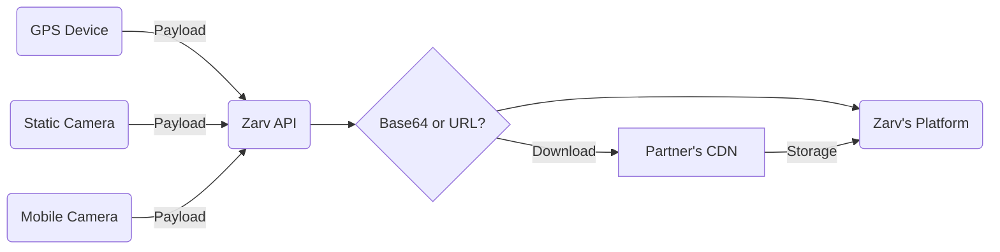

# LPR Devices Data Provider Guide

Our current integration supports both mobile and fixed cameras networks, and you can chose to sent the captured image by `base64` or `link` strategy (if exists).



:lock: [Check here how to authenticate](../api/authentication.md)

## API Fields

| Field                                                      | Type   | Description                                                                                                         |
|------------------------------------------------------------|--------|---------------------------------------------------------------------------------------------------------------------|
| `id` <Badge type="danger" text="required" />               | String | Unique capture ID                                                                                                   |
| `device_id` <Badge type="danger" text="required" />        | String | Device ID                                                                                                           |
| `created_at` <Badge type="danger" text="required" />       | String | Capture date ([ISO 8601](https://www.w3.org/TR/NOTE-datetime))                                                      |
| `latitude` <Badge type="danger" text="required" />         | Number | Float number                                                                                                        |
| `longitude` <Badge type="danger" text="required" />        | Number | Float number                                                                                                        |
| `license_plate` <Badge type="danger" text="required" />    | String | License plate detected by LPR                                                                                       |
| `license_plate_accuracy`                                   | Number | LPR accuracy (`from 0 to 1`)                                                                                        |
| `speed`                                                    | Number | Vehicle Speed                                                                                                       |
| `image` <Badge type="warning" text="required" />           | String | Base64 data (in `JPEG` or `PNG` formats)                                                                            |
| `image_url` <Badge type="warning" text="required" />       | String | Fully formatted URL (in `JPEG` or `PNG` formats)                                                                    |
| `bounding_box`                                             | JSON   | Detected vehicle and lane positions `i.e: [{ x1, y1, x2, y2 }, { x1, y1, x2, y2 }] or [[x1,y1,x2,y2],[x1,y1,x2,y2]]` |

::: warning Upload Priority
If you sent both `Base64` and `External Image`, our system will use only the **External Image** data.
:::

## Vehicle Image Strategies

Currently, our API support receive the vehicle photo using two differents approachs: [Base64](#inline-base64-image) or [External Image](#external-image-url). We accept both `JPEG` and `PNG` formats.

### Inline Base64 Image

If you decide to send the image with **Base64** on the request's payload is required to inform the image `content type` like the example below:

```json:line-numbers {10}
{
  "id": "688cebe6-8cec-4b46-b34e-bfaa4b4f7860",
  "device_id": "60ede5f5-c9ba-4d38-8e10-a18ea8cebbef",
  "created_at": "2023-01-15T13:15:30-03:00",
  "latitude": -23.634471,
  "longitude": -46.727415,
  "license_plate": "ZRV2A23",
  "license_plate_accuracy": 0.8,
  "speed": 89,
  "image": "data:image/png;base64,iVBORw0KGgoAAAANSUhEUgAAACAAAAAgCAYAAABzGdBT...truncated",
  "bounding_box": [{ x1, y1, x2, y2 }, { x1, y1, x2, y2 }]
}
```

### External Image URL

To external images, you just need to fill the field `image_url` and make sure the url is fully available under HTTPs protocol.

```json:line-numbers {10}
{
  "id": "688cebe6-8cec-4b46-b34e-bfaa4b4f7860",
  "device_id": "60ede5f5-c9ba-4d38-8e10-a18ea8cebbef",
  "created_at": "2023-01-15T13:15:30-03:00",
  "latitude": -23.634471,
  "longitude": -46.727415,
  "license_plate": "ZRV2A23",
  "license_plate_accuracy": 0.8,
  "speed": 89,
  "image_url": "https://my.server.com/image.jpg",
  "bounding_box": [{ x1, y1, x2, y2 }, { x1, y1, x2, y2 }]
}
```

::: warning Image Buckets
If your image is under an authenticated bucket, please provide the access params on the url. Like this: `https://my.server.com/image.jpg?authorization=xyzljnasdjn`
:::

#### Responses for successful requests

Status code: `202`

```json
{
  "status": "success",
  "stage": "production"
}
```

#### Responses for non successful requests

Status code: `400`

eg.

```json
{
  "contract": "camera",
  "validations": [
    {
      "instancePath": "/vehicle",
      "schemaPath": "#/properties/vehicle/required",
      "keyword": "required",
      "params": {
        "missingProperty": "X"
      },
      "message": "deve ter a propriedade obrigatória X"
    }
  ]
}
```
