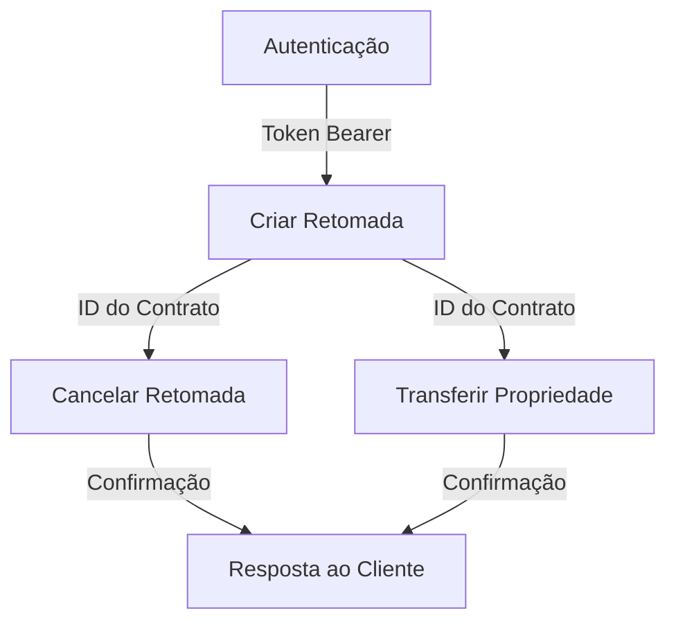

# Detran API

A API de Retomada de Veículos, desenvolvida pelo Detran, facilita a integração com a Zarv para a gestão de processos de retomada extrajudicial de veículos. Ela oferece endpoints para autenticação, criação, cancelamento de retomadas e transferência de propriedade, automatizando e simplificando operações com maior eficiência e segurança.

## Fluxo de Dados da API

O diagrama abaixo ilustra o fluxo de dados entre os principais endpoints da API:



## Métodos da API

Para autenticar-se, envie seu nome de usuário e senha ao endpoint de autenticação. O token Bearer gerado será usado para autorizar requisições subsequentes.

**Regras de Negócio:**

- O token é válido por 24 horas e deve ser renovado após expirar.
- Apenas usuários cadastrados podem autenticar-se.

**Endpoint:** `/api/v1/autenticacao`  
**Método:** `POST`

**Cabeçalhos:**

- `Content-Type: application/json`
- `usuario`: Nome de usuário.
- `senha`: Senha do usuário.

**Resposta:**

- **Sucesso (200 OK):**

    ```json
    {
        "token": "seu_token_de_acesso",
        "expiraEm": "YYYY-MM-DDTHH:MM:SSZ"
    }
    ```

- **Erro (401 Não Autorizado):**

    ```json
    {
        "error": "Nome de usuário ou senha inválidos"
    }
    ```

Inclua o token no cabeçalho `Authorization` para autenticar requisições:

```http
GET /api/v1/registro HTTP/1.1
Host: retomada-veicular.com
Authorization: Bearer seu_token_de_acesso
```

## Criar Retomada de Veículo

Crie um registro de retomada fornecendo informações detalhadas sobre o contrato, veículo e motivo.

**Regras de Negócio:**  

- Apenas contratos com parcelas em atraso podem ser registrados.
- O débito não pode exceder o valor total do contrato.
- A data de retomada deve ser futura e não ultrapassar 30 dias.

**Endpoint:** `/api/v1/registro`  
**Método:** `POST`

**Cabeçalhos:**

- `Content-Type: application/json`
- `Authorization: Bearer <token>`

**Corpo da Requisição:**

```json
{
    "idContrato": "string",
    "valorDebito": "number",
    "valorContrato": "number",
    "parcelasAtraso": "number",
    "placa": "string",
    "renavam": "string",
    "numeroDocumento": "string",
    "dataRetomada": "string",
    "motivo": "string"
}
```

## Cancelar Retomada de Veículo

Cancele um registro de retomada existente informando o motivo.

**Regras de Negócio:**  

- Apenas registros com status "pendente" podem ser cancelados.
- O motivo deve ter no máximo 255 caracteres.

**Endpoint:** `/api/v1/cancelamento`  
**Método:** `PUT`

## Transferir Propriedade do Veículo

Transfira a propriedade de um veículo para uma entidade de crédito ou banco.

**Regras de Negócio:**  

- Apenas veículos com retomada concluída podem ser transferidos.
- A data de transferência deve ser futura e não ultrapassar 15 dias.
- O documento de transferência deve ser válido.

**Endpoint:** `/api/v1/transferencia`  
**Método:** `PUT`
