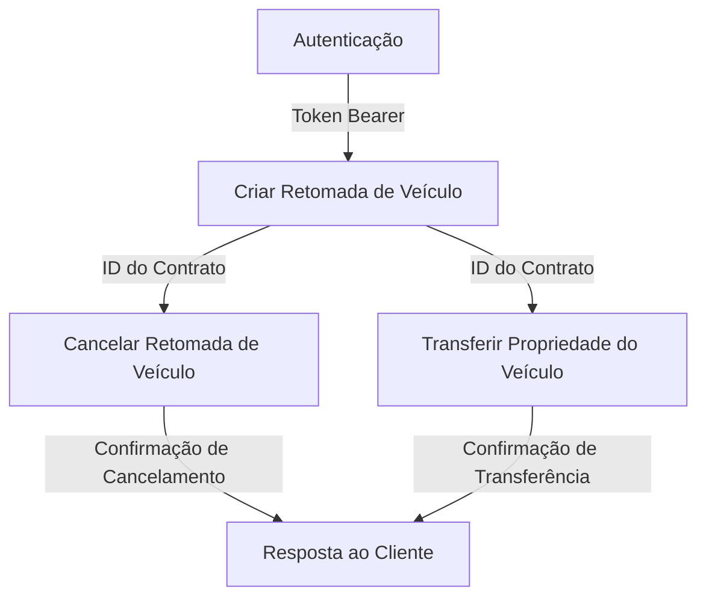

# Detran API

A API de Retomada de Veículos é uma solução desenvolvida pelo Detran para facilitar a integração com a Zarv, permitindo a gestão de processos de retomada extrajudicial de veículos. Essa API oferece endpoints para autenticação, criação de registros de retomada, cancelamento de retomadas e transferência de propriedade de veículos. Com isso, é possível automatizar e simplificar as operações relacionadas à recuperação de veículos, garantindo maior eficiência e segurança no processo.

## Fluxo de Dados da API

Abaixo está um diagrama representando o fluxo de dados entre os endpoints da API de Retomada de Veículos:



Este diagrama ilustra como os dados fluem entre os endpoints principais da API, começando pela autenticação e passando pelos processos de criação, cancelamento e transferência de propriedade.

## Autenticação

Para autenticar-se com a API de Retomada de Veículos, você precisa obter um token Bearer enviando seu nome de usuário e senha para o endpoint de autenticação via cabeçalhos de requisição. Esse token será utilizado para autorizar todas as requisições subsequentes aos demais endpoints da API.

**Regra de Negócio:**

- O token gerado tem validade de 24 horas e deve ser renovado após expirar.
- Apenas usuários previamente cadastrados no sistema podem autenticar-se.

**Endpoint:** `/api/v1/autenticacao`  
**Método:** `POST`

**Cabeçalhos da Requisição:**

- `Content-Type: application/json`: Define o formato do corpo da requisição como JSON.
- `usuario`: Nome de usuário fornecido para autenticação.
- `senha`: Senha correspondente ao nome de usuário.

**Resposta:**

- **Sucesso (200 OK):** Retorna um token de acesso e a data de expiração do token.

    ```json
    {
        "token": "seu_token_de_acesso",
        "expiraEm": "YYYY-MM-DDTHH:MM:SSZ"
    }
    ```

- **Erro (401 Não Autorizado):** Indica que o nome de usuário ou senha fornecidos são inválidos.

    ```json
    {
        "error": "Nome de usuário ou senha inválidos"
    }
    ```

Após obter o token, inclua-o no cabeçalho `Authorizacao` de todas as requisições subsequentes para autenticar e autorizar o acesso aos endpoints.

**Exemplo de Requisição Autenticada:**

```http
GET /api/v1/registro HTTP/1.1
Host: retomada-veicular.com
Authorizacao: Bearer seu_token_de_acesso
```

Se o token estiver ausente ou inválido, a API retornará uma resposta `401 Não Autorizado`.

## Criar Retomada de Veículo

Este endpoint permite criar um novo registro de retomada de veículo, fornecendo informações detalhadas sobre o contrato, o veículo e o motivo da retomada.

**Regra de Negócio:**  

- Apenas contratos com parcelas em atraso podem ser registrados para retomada.
- O valor do débito não pode ser superior ao valor total do contrato.
- A data de retomada deve ser futura e não pode ultrapassar 30 dias a partir da data atual.

**Endpoint:** `/api/v1/registro`  
**Método:** `POST`  
**Descrição:** Cria um registro de retomada de veículo com base nos dados fornecidos.

**Cabeçalhos da Requisição:**

- `Content-Type: application/json`: Define o formato do corpo da requisição como JSON.
- `Authorization: Bearer <token>`: Token de autenticação obtido no endpoint de autenticação.

**Corpo da Requisição:**

```json
{
    "idContrato": "string",
    "valorDebito": "number",
    "valorContrato": "number",
    "parcelasAtraso": "number",
    "placa": "string",
    "renavam": "string",
    "numeroDocumento": "string",
    "dataRetomada": "string",
    "motivo": "string"
}
```

...

## Cancelar Retomada de Veículo

Este endpoint permite cancelar um processo de retomada de veículo existente, fornecendo os dados necessários para identificar o registro e o motivo do cancelamento.

**Regra de Negócio:**  

- Apenas registros de retomada com status "pendente" podem ser cancelados.
- O motivo do cancelamento deve ser informado e não pode exceder 255 caracteres.

**Endpoint:** `/api/v1/cancelamento`  
**Método:** `PUT`  
**Descrição:** Cancela um registro de retomada de veículo previamente criado.

...

## Transferir Propriedade do Veículo

Este endpoint permite transferir a propriedade de um veículo do proprietário atual (devedor) para uma entidade de crédito ou banco, formalizando a mudança de titularidade.

**Regra de Negócio:**  

- Apenas veículos com retomada concluída podem ter a propriedade transferida.
- A data de transferência deve ser futura e não pode ultrapassar 15 dias a partir da data atual.
- O documento de transferência deve ser válido e registrado no sistema.

**Endpoint:** `/api/v1/transferencia`  
**Método:** `PUT`  
**Descrição:** Realiza a transferência de propriedade do veículo para a entidade de crédito.

...
