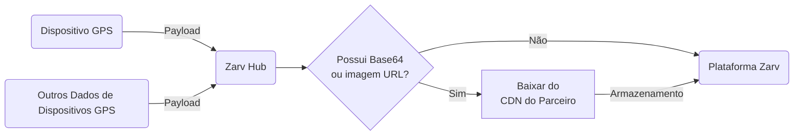

# Guia de Provedores de Dados de Dispositivos GPS

Dispositivos GPS são essenciais para rastrear dados de localização em tempo real. Eles fornecem informações geográficas precisas que podem ser usadas em diversas aplicações, como logística, gestão de frotas e navegação pessoal.

Este guia fornece uma visão geral sobre como integrar dispositivos GPS como provedores de dados em seu sistema.



## Campos da API

| Campo                                                                | Tipo   | Descrição { class="compact" }                       |
| -------------------------------------------------------------------- | ------ | --------------------------------------------------- |
| device.id <Badge type="warning" text="obrigatório" />                | String | IMEI do dispositivo                                 |
| device.status <Badge type="warning" text="obrigatório" />            | String | [ENUM de status de comando](#enums-disponiveis-api) |
| device.gsm_signal                                                    | Number | Valor do sinal GSM RSSI [Descrição](#gsm-rssi)      |
| device.gsm_signal_level                                              | String | Nível do sinal GSM RSSI [Descrição](#nivel-gsm-rssi)|
| device.gps_satellites                                                | Number | Total de satélites GPS disponíveis                 |
| vehicle.vin <Badge type="warning" text="obrigatório" />              | String | VIN do veículo [Descrição](#VIN)                   |
| vehicle.license_plate                                                | String | Placa do veículo                                   |
| vehicle.engine_status <Badge type="warning" text="obrigatório" />    | String | Status do motor (LIGADO/DESLIGADO)                 |
| vehicle.speed <Badge type="warning" text="obrigatório" />            | Number | Velocidade em Km/h                                 |
| vehicle.odometer <Badge type="warning" text="obrigatório" />         | Number | Hodômetro do veículo em Km                         |
| vehicle.battery.system <Badge type="warning" text="obrigatório" />   | Number | Voltagem da bateria do veículo                     |
| vehicle.battery.device                                               | Number | Voltagem da bateria do dispositivo                 |
| vehicle.battery.device_percentage                                    | Number | Porcentagem da bateria do dispositivo              |
| vehicle.location.elevation                                           | Number | Elevação do veículo em metros                      |
| vehicle.location.heading                                             | Number | Direção do veículo em graus                        |
| vehicle.location.location <Badge type="warning" text="obrigatório" />| Array  | [longitude, latitude]                              |
| vehicle.behavior                                                     | String | [Um dos comportamentos disponíveis](#enums-disponiveis-api) |
| received_at                                                          | String | Data do evento recebida pela plataforma em UTC ISO |
| created_at <Badge type="warning" text="obrigatório" />               | String | Data do evento em UTC ISO                          |

:::warning O que é o VIN?

O VIN - Número de Identificação do Veículo (ou NIV), é o sistema universal de registro para veículos automotivos produzidos.

:::

:::details Nível do Sinal GSM RSSI

| Nível RSSI | Força do sinal | Descrição                                                                                                  |
| ---------- | -------------- | ---------------------------------------------------------------------------------------------------------- |
| EXCELENTE  | Excelente      | Sinal forte com interferências mínimas, velocidades de dados excelentes                                    |
| BOM        | Bom            | Sinal forte com boas velocidades de dados                                                                 |
| REGULAR    | Regular         | Útil, velocidades rápidas e confiáveis podem ser atingidas, mas quedas de conexão são possíveis           |
| FRACO      | Fraco          | O desempenho cairá drasticamente                                                                          |
| SEM_SINAL  | Sem sinal      | Desconexão                                                                                                |

Esses enums são usados para determinar a força do sinal do dispositivo. Os valores são baseados no RSSI (Indicador de Força do Sinal Recebido), que mede o nível de potência que um dispositivo recebe de uma torre celular.

| RSSI                | Força do sinal | Descrição                                                                                                  |
| ------------------- | -------------- | ---------------------------------------------------------------------------------------------------------- |
| > -70 dBm           | Excelente      | Sinal forte com interferências mínimas, velocidades de dados excelentes                                    |
| -70 dBm a -85 dBm   | Bom            | Sinal forte com boas velocidades de dados                                                                 |
| -86 dBm a -100 dBm  | Regular         | Útil, velocidades rápidas e confiáveis podem ser atingidas, mas quedas de conexão são possíveis           |
| < -100 dBm          | Fraco          | O desempenho cairá drasticamente                                                                          |
| -110 dBm            | Sem sinal      | Desconexão                                                                                                |

:::

:::details Status do Veículo

| Status              | Descrição                                   |
| ------------------- | ------------------------------------------- |
| LOCKED              | Veículo está trancado                      |
| OPERATIONAL         | Veículo está destrancado e funcionando bem |
| SETUP               | Dispositivo não instalado                  |
| SOFT_LOCK_RECEIVED  | Comando de bloqueio suave recebido          |
| SOFT_LOCK_APPLYING  | Aplicando comando de bloqueio suave         |
| SOFT_LOCK_CONFIRMED | Comando de bloqueio suave concluído         |
| HARD_LOCK_RECEIVED  | Comando de bloqueio rígido recebido         |
| HARD_LOCK_APPLYING  | Aplicando comando de bloqueio rígido        |
| HARD_LOCK_CONFIRMED | Comando de bloqueio rígido concluído        |
| UNLOCK_RECEIVED     | Comando de destravamento recebido           |
| UNLOCK_APPLYING     | Aplicando comando de destravamento          |
| UNLOCK_CONFIRMED    | Comando de destravamento concluído          |

:::

:::details Comportamento do Veículo

| Status                 | Descrição { class="compact" }                                               |
| ---------------------- | --------------------------------------------------------------------------- |
| DEVICE_POWER_ON        | Retorno de energia ao dispositivo                                           |
| DEVICE_VOIDED          | Dispositivo violado, sensor de luz ativado ou movimento detectado           |
| DEVICE_VIOLATED_ENERGY | Dispositivo violado, leituras de voltagem da bateria do veículo ou dispositivo alteradas |
| ENGINE_ON              | Ignição ligada                                                             |
| ENGINE_OFF             | Ignição desligada                                                          |
| SOFT_ACCELERATION      | Aceleração leve                                                            |
| HARD_ACCELERATION      | Aceleração brusca                                                          |
| SOFT_BREAK             | Frenagem leve                                                              |
| HARD_BREAK             | Frenagem brusca                                                            |
| SOFT_TURN              | Curva leve                                                                 |
| HARD_TURN              | Curva brusca                                                               |
| TOKEN_EXPIRED          | Token do motorista expirado                                                |
| TRIP_START             | Início da rota                                                             |
| TRIP_END               | Fim da rota                                                                |

:::

## Exemplo de Payload

```json #
{
  "device": {
  "id": "AABBBBBBCCCCCCD",
  "status": "OPERATIONAL",
  "gsm_signal": -72,
  "gps_satellites": 8
  },
  "vehicle": {
  "vin": "4Y1SL65848Z411430",
  "license_plate": "ZRV2A23",
  "behavior": "ENGINE_ON",
  "engine_status": "ON",
  "speed": 12,
  "odometer": 124,
  "battery": {
    "system": 12.707,
    "device": 4.166,
    "device_percentage": 100
  },
  "location": {
    "elevation": 143,
    "heading": 24,
    "location": [-27.607124, -48.5752832]
  }
  },
  "received_at": "2023-01-02T12:23:02Z",
  "created_at": "2023-01-02T12:23:02Z"
}
```

:::warning Informações importantes sobre datas
As datas no payload estão no formato **UTC ISO**. O formato da data é `YYYY-MM-DDTHH:mm:ssZ`, onde `T` separa a data e a hora, e `Z` indica que o horário está em UTC.
:::

## Respostas para requisições bem-sucedidas

Código de status: `202`

```json
{
  "status": "success",
  "stage": "prod"
}
```

## Respostas para requisições não bem-sucedidas

Código de status: `400`

ex.

```json
{
  "contract": "gps",
  "validations": [
  {
    "instancePath": "/vehicle",
    "schemaPath": "#/properties/vehicle/required",
    "keyword": "required",
    "params": {
    "missingProperty": "X"
    },
    "message": "deve ter a propriedade obrigatória X"
  }
  ]
}
```
