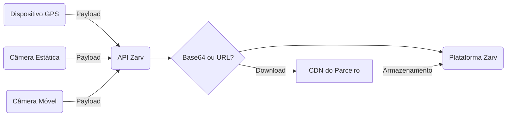

# Guia de Provedores de Dados para Dispositivos LPR

Nossa integração atual suporta redes de câmeras móveis e fixas, e você pode optar por enviar a imagem capturada utilizando a estratégia de `base64` ou `link` (se existir).



## Campos da API

| Campo                                                      | Tipo   | Descrição                                                                                                           |
|------------------------------------------------------------|--------|---------------------------------------------------------------------------------------------------------------------|
| `id` <Badge type="danger" text="obrigatório" />            | String | ID único da captura                                                                                                 |
| `device_id` <Badge type="danger" text="obrigatório" />     | String | ID do dispositivo                                                                                                   |
| `created_at` <Badge type="danger" text="obrigatório" />    | String | Data da captura ([ISO 8601](https://www.w3.org/TR/NOTE-datetime))                                                   |
| `latitude` <Badge type="danger" text="obrigatório" />      | Number | Número decimal                                                                                                      |
| `longitude` <Badge type="danger" text="obrigatório" />     | Number | Número decimal                                                                                                      |
| `license_plate` <Badge type="danger" text="obrigatório" /> | String | Placa detectada pelo LPR                                                                                           |
| `license_plate_accuracy`                                   | Number | Precisão do LPR (`de 0 a 1`)                                                                                       |
| `speed`                                                    | Number | Velocidade do veículo                                                                                              |
| `image` <Badge type="warning" text="obrigatório" />        | String | Dados em Base64 (nos formatos `JPEG` ou `PNG`)                                                                     |
| `image_url` <Badge type="warning" text="obrigatório" />    | String | URL completa (nos formatos `JPEG` ou `PNG`)                                                                        |
| `bounding_box`                                             | JSON   | Posições detectadas do veículo e da pista `ex: [{ x1, y1, x2, y2 }, { x1, y1, x2, y2 }] ou [[x1,y1,x2,y2],[x1,y1,x2,y2]]` |

::: warning Prioridade de Upload
Se você enviar tanto `Base64` quanto `Imagem Externa`, nosso sistema usará apenas os dados da **Imagem Externa**.
:::

## Estratégias de Imagem do Veículo

Atualmente, nossa API suporta o envio da foto do veículo utilizando duas abordagens diferentes: [Base64](#imagem-inline-base64) ou [Imagem Externa](#url-de-imagem-externa). Aceitamos os formatos `JPEG` e `PNG`.

### Imagem Inline Base64

Se você optar por enviar a imagem em **Base64** no payload da requisição, é necessário informar o `content type` da imagem, como no exemplo abaixo:

```json:line-numbers {10}
{
  "id": "688cebe6-8cec-4b46-b34e-bfaa4b4f7860",
  "device_id": "60ede5f5-c9ba-4d38-8e10-a18ea8cebbef",
  "created_at": "2023-01-15T13:15:30-03:00",
  "latitude": -23.634471,
  "longitude": -46.727415,
  "license_plate": "ZRV2A23",
  "license_plate_accuracy": 0.8,
  "speed": 89,
  "image": "data:image/png;base64,iVBORw0KGgoAAAANSUhEUgAAACAAAAAgCAYAAABzGdBT...truncated",
  "bounding_box": [{ x1, y1, x2, y2 }, { x1, y1, x2, y2 }]
}
```

### URL de Imagem Externa

Para imagens externas, basta preencher o campo `image_url` e garantir que a URL esteja totalmente acessível pelo protocolo HTTPs.

```json:line-numbers {10}
{
  "id": "688cebe6-8cec-4b46-b34e-bfaa4b4f7860",
  "device_id": "60ede5f5-c9ba-4d38-8e10-a18ea8cebbef",
  "created_at": "2023-01-15T13:15:30-03:00",
  "latitude": -23.634471,
  "longitude": -46.727415,
  "license_plate": "ZRV2A23",
  "license_plate_accuracy": 0.8,
  "speed": 89,
  "image_url": "https://my.server.com/image.jpg",
  "bounding_box": [{ x1, y1, x2, y2 }, { x1, y1, x2, y2 }]
}
```

::: warning Buckets de Imagem
Se sua imagem estiver em um bucket autenticado, forneça os parâmetros de acesso na URL. Exemplo: `https://my.server.com/image.jpg?authorization=xyzljnasdjn`
:::

#### Respostas para requisições bem-sucedidas

Código de status: `202`

```json
{
  "status": "success",
  "stage": "production"
}
```

#### Respostas para requisições malsucedidas

Código de status: `400`

ex.

```json
{
  "contract": "camera",
  "validations": [
  {
    "instancePath": "/vehicle",
    "schemaPath": "#/properties/vehicle/required",
    "keyword": "required",
    "params": {
    "missingProperty": "X"
    },
    "message": "deve ter a propriedade obrigatória X"
  }
  ]
}
```
